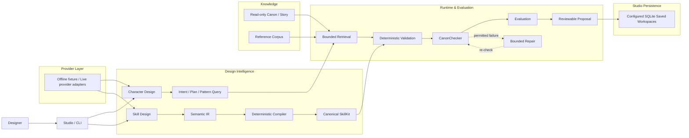

# Game AI Agent

**Structured AI-assisted game content design and authoring**

**English** | [简体中文](README.zh-CN.md)

[](https://github.com/glt258/game-ai-agent/actions/workflows/ci.yml)

Game AI Agent is building a structured system for designing and authoring game content with AI. It is not a prompt wrapper or a complete AI-native game development platform. The current repository focuses on character and skill design, Canon-aware retrieval, deterministic validation, evaluation, and local Studio workflows.

Long-term, the project aims at broader game-content development; today, model output is a proposal, the authoring flow reads Canon without writing it, and human review remains authoritative.

## Project Context

The project began as **Along the Street**, the repository's built-in Canon, test
world, and development setting. It started from a narrower Character Authoring
pipeline: help designers turn a brief into a grounded, reviewable proposal
without letting a model invent world facts or overwrite established story data.
The current structured character-and-skill system is an evolution of that
boundary, not a claim that the repository is already a complete game-production
platform.

The Character Authoring milestone also established age-ambiguous and diverse
life-stage handling without mechanically mapping presentation to school,
occupation, authority, or narrative importance. Exact, legal, and historical
age information remains distinct from current non-student status; see the
[life-stage coverage](docs/character_diversity_life_stage_v0.3.md) and [age
information preservation](docs/character_age_information_preservation_v0.3.md)
contracts.

## What it can do now

- Turn a designer brief into a structured, reviewable `CharacterDraft`.
- Ground character authoring in bounded, read-only Canon and story retrieval.
- Project design intent and retrieve design precedents from the Reference Corpus.
- Design skills through Semantic IR, deterministic compilation, canonical `SkillKit`, evaluation, diagnostics, and bounded semantic repair.
- Run deterministic checks with auditable tool/model invocations.
- Provide a local Next.js + FastAPI Studio with explicit SQLite-backed Saved Character workspaces.

## Current Capabilities

### Character Design & Authoring

```text
Designer Brief → intent / plan → bounded Canon retrieval
  → CharacterDraft generation → deterministic validation → CanonChecker
  → at most one permitted repair → human review
```

`CharacterDraft` is a reviewable proposal, not an approval or a Canon write.
The authoring toolbox exposes allowlisted lore, faction, character, world-rule,
and story queries; it does not expose arbitrary files or write operations.

### Character Intelligence

`CharacterDesignIntent`, `CharacterDesignPlan`, and `DesignPatternQuery` provide
structured projections of a brief. The deterministic reference selector finds
relevant precedent and contrast candidates. These are design aids, not hidden
chain-of-thought or a second character schema.

### Skill Design

Skill Design v1 (`CS-S2`) supports Main DPS, Sub-DPS, Support, Healer/Reaction,
Control, Defense, and Basic Passive families:

```text
Requirement / context → Semantic IR → IR validation
  → deterministic compiler → canonical SkillKit → parser / reference integrity
  → evaluator → safe diagnostics
```

Semantic repair is limited to one attempt after a validated IR reaches evaluator
failure. Provider, parse, compiler, and reference-integrity failures do not
silently become repaired success. Advanced v2 mechanics remain out of scope;
see the [Skill Design v1 freeze](docs/character_generation/character_skill_design_v1_freeze_v1.0.md).

The `v0.8` release also includes the Manual Skill Playground CLI with
natural-language requirements, role/mode, model and language selection, safe
diagnostics, and one bounded repair opportunity. Human-readable playground text
supports Simplified Chinese and English while machine-readable protocol fields
remain authoritative English values.

### Canon, Knowledge & Reference Corpus

- `src/knowledge/` and packaged resources provide default-deny, read-only Canon,
  world, faction, lore, character, case, incident, project, and story access.
- `CanonChecker` applies deterministic conflict, authority, grounding, scope,
  and hard-constraint checks.
- `reference-corpus-v0.5` is a frozen corpus of structured facts, sources, and
  analysis for design precedent and evaluation.

The Reference Corpus is not a copy bank, few-shot answer bank, commercial
imitation dataset, RAG claim, or source of Canon authority. Its selector is
bounded and deterministic; its selection metrics do not claim better generation.

The top-level `knowledge/` directory is the Engineering Knowledge Layer and
Project Graph: supporting traceability infrastructure, not a claim of reduced
tool usage or solved agent planning.

The frozen `reference-corpus-v0.5` baseline contains 16 accepted corpus
characters; “production” here means accepted and frozen corpus records, not
production readiness of the overall Agent system. Its production boundary is
declared by the manifest at
`src/along_street_resources/data/reference_corpus/characters/_catalog/corpus_manifest.yaml`.
Runtime code loads only manifest-declared records by default. Temporary
synthetic or external corpora must opt into `manifest_policy="unmanaged"`, and
corpus expansion is gap-driven: a concrete Generator, Canon, Repair, or
evaluation failure must show that an existing precedent is insufficient first.
The [Reference Corpus production baseline](docs/reference_corpus/production_baseline_v0.1.md)
documents this boundary.

Packaged runtime data is resolved from the single
`src/along_street_resources/data/` tree through `data_root()` and
`data_resource()`, independently of the checkout working directory. Explicit
filesystem paths are reserved for callers intentionally supplying external data
or corpus directories.

### Local Studio

The experimental local Studio is layered over the Python runtime:

- `web/`: Next.js App Router, React, TypeScript, and Tailwind CSS frontend.
- `src/web/`: FastAPI adapter and typed DTOs.
- Character Studio: generate, inspect, edit, and revalidate a draft.
- Reference Corpus browser, public-safe Canon Explorer, and Skill Playground.
- Skill Playground includes a Chinese planner view with Design Result, Design
  Checks, and Technical Details tabs; Character context reports skill validity
  and alignment and requires an explicit attach action without auto-approval.
- Saved Character workspaces with revisions, Skill associations, Kit assignments,
  and caller-configured SQLite persistence.
- Offline runs remain synchronous. Explicit live Character/Skill runs use
  bounded process-local jobs and polling; live results remain review-only and
  are never auto-attached to a Character or Kit.

It does not publish Canon, expose raw provider responses or secrets, or provide
arbitrary file access or multi-agent orchestration. The Web API does not use
WebSockets or SSE for live execution; its live job contract is explicit and
polling-based.

### Unified CLI and Studio startup

The installable Python runtime provides diagnostic and source-checkout Studio
commands:

```powershell
game-ai-agent doctor
game-ai-agent doctor --json
game-ai-agent studio --no-browser
```

The wheel contains the core runtime and packaged resources. The Next.js Studio
frontend remains source-checkout-only in v0.1: build `web/.next` first with
`cd web; npm ci; npm run build`. The launcher starts FastAPI and `next start`,
waits for both readiness endpoints, and cleans up both child processes on exit.
See the [CLI and Studio startup contract](docs/cli_and_studio_startup_contract_v0.1.md).

### Provider Layer

The agent API is provider-independent. Current logical profiles include `openai`,
`deepseek`, `opencode_go`, and `openai_compatible` over the implemented OpenAI
Chat Completions transport.

- Offline deterministic fixtures support local development and tests.
- Live execution is credential-gated and capability-profile driven.
- Unknown or unsupported transport choices fail before a request; there is no
  silent fallback.
- Audits expose only sanitized metadata, never keys, raw prompts, raw responses, or unrestricted exception text.

Live observations are bounded evidence for particular configurations, not a
benchmark or universal model-quality claim. See the [provider capability layer](docs/provider_capability_layer.md).

## Evidence / Verified Runs

One verified live Character Authoring E2E run used provider `opencode_go` with
model `deepseek-v4-flash`. A Canon-dependent brief required membership in an
existing organization; retrieval selected `faction_005`
(`临洲市公共安全联席体系`) and produced the draft character `方宁舒`, whose
occupation was `临洲市公共安全联席体系大型活动安全组现场协作员`. The draft
contained grounded Canon Basis entries for `faction_005`, `lore_023`,
`lore_024`, `lore_026`, and `char_launch_007`. This is one verified live
example, not a benchmark or a universal model-quality claim.

The repository also preserves sanitized historical provider evidence for
Character Skill, S2, and Hybrid Semantic IR investigations under
[`tests/fixtures/historical_evidence/`](tests/fixtures/historical_evidence/).
These metadata-only fixtures support reproducible validation without causing
provider calls in CI. The [Hybrid Semantic IR success baseline](docs/hybrid_semantic_ir_e2e_success_baseline_v0.1.md)
records the corresponding historical contract.

The hermetic E2E seam injects a deterministic provider for the full
provider-to-evaluator path, while the production/live provider factory remains
credential-gated. A historical clean-checkout CI baseline is recorded in
[GitHub Actions run #17](https://github.com/glt258/game-ai-agent/actions/runs/33238359141);
it is historical evidence, not a current CI-status claim.

## Architecture

The repository separates UI, design intelligence, knowledge, execution, and evaluation without pretending to be a distributed services system.



## Project Status

| Area | Status |
| --- | --- |
| Public release | `v0.8` — Skill Design v1 and Manual Skill Playground release |
| Character Authoring | Frozen runtime baseline with bounded retrieval, validation, Canon checking, and repair |
| Runtime Baseline | `runtime-v0.6.6` — frozen Character Authoring runtime baseline |
| Character Intelligence | `CI-B1.5` canonical combat-role boundary; intent/plan and pattern-query infrastructure present |
| Character Skill | `CS-S1.1` — frozen skill interface-design milestone |
| Skill Design | `CS-S2` / Skill Design v1 feature-frozen semantic coverage |
| Reference Corpus | `reference-corpus-v0.5`, frozen expanded baseline |
| Hybrid Semantic IR | `hybrid-semantic-ir-e2e-v0.1` — historical real-provider evaluator PASS baseline |
| Studio | Local Web v0.1 implemented; experimental relative to the `v0.8` release architecture |
| Repository Knowledge | Engineering Knowledge Layer and Project Graph as supporting infrastructure |

The public `v0.8` release is not retroactively redefined by the experimental Studio and W4 working-tree architecture. See [Versioning](docs/versioning.md) and the [v0.8 release notes](docs/release_notes_v0.8.md).

## Design Principles

### Structured before free-form

Generated text is not a final asset; typed contracts, explicit fields, and machine-checkable relationships come first.

### Canon is evidence, not prompt decoration

Existing world facts must be retrieved and supported. Model memory does not become Canon evidence.

### Deterministic checks where possible

Schema, IDs, relationships, grounding, and semantic contracts are checked by code when a deterministic rule is available. An LLM is not the Canon authority.

### Human authority

Agents propose. Human review owns approval, publication, and future Canon change.

### Models are replaceable

Agent contracts do not depend on a single vendor; capability is negotiated at the adapter boundary.

### Fail closed

Unparseable, unproven, or out-of-contract results fail explicitly rather than quietly filling gaps.

## Quick Start

### Python runtime

```powershell
git clone https://github.com/glt258/game-ai-agent.git
cd game-ai-agent
py -m venv .venv
.\.venv\Scripts\Activate.ps1
python -m pip install -e ".[dev]"
game-ai-agent doctor
python -m agents.official_character_authoring --scenario valid --model offline
```

The installed authoring entry point is also available as
`along-street-character-author`.

### Local Studio

From a source checkout with the Python runtime installed:

```powershell
cd web
npm ci
npm run build
cd ..
game-ai-agent studio --no-browser
```

Open <http://localhost:3000>. The launcher starts the FastAPI backend on
`http://127.0.0.1:8000` and the production Next.js frontend on port 3000. Saved
workspaces default to the platform app-data directory; use
`GAME_AI_AGENT_DB_PATH` for an explicit SQLite path.

### Testing

The normal project check is:

```powershell
python -m pytest -q
```

Focused provider, Web, persistence, and evaluation checks live under `tests/` and `scripts/`. Live provider runs are opt-in and credential-gated.

## Repository Layout

```text
src/        core runtime, agents, design intelligence, knowledge, persistence, Web adapter
web/        Next.js Studio frontend
knowledge/  Engineering Knowledge Layer and Project Graph
tests/      deterministic, contract, integration, and regression tests
evals/      evaluation cases, fixtures, and sanitized evidence
docs/       contracts, freezes, architecture notes, and release evidence
scripts/    demos and development / validation tooling
```

Along the Street is the repository's built-in Canon, test world, and development
setting. The architecture is intended to support structured game-content
authoring beyond that single fictional setting.

## Roadmap

### Current development focus

1. Studio UX and productization.
2. Deeper Character Design Intelligence.
3. Deeper Skill and Combat Design Intelligence.
4. Stronger evaluation and simulation.
5. A governed data pipeline for future model training.

### Longer-term direction — planned / exploratory

- Specialized small-model fine-tuning.
- Story and Canon generation workflows.
- Multi-agent content design.
- Broader worldbuilding workflows.

These are planned or exploratory, not current capabilities; no dates or release promises are implied.

## Known Boundaries

- Not production-ready and not a completed game-development platform.
- No claim of autonomous skill balancing or universal model quality.
- Canon is read-only to authoring; approval, publishing, and Canon mutation are not implemented.
- The corpus is precedent and analysis, not authoritative lore or imitation data.
- Multi-agent orchestration, Story Generation Agent, broad memory/planning, and specialized fine-tuning are not implemented claims.
- Live evidence is small-sample and configuration-specific; latency and bounded provider attempts can still prevent completion.

At runtime, Canon-dependent claims without successful retrieval grounding,
unknown or malformed Canon IDs, pseudo-tool JSON, and malformed or exhausted
provider interactions fail closed. Finalization receives no tools; repair is at
most one bounded attempt and cannot write Canon, approve a draft, escape its
editable scope, or silently violate hard constraints. Live diagnostics retain
only sanitized provider/model metadata and allowlisted failure details.

## Further Reading

- [Character Generation Agent](docs/character_generation_agent_v0.1.md)
- [Runtime Freeze runtime-v0.6.6](docs/runtime_freeze_v0.6.6.md)
- [Canon Checker](docs/canon_checker_v0.1.md)
- [Character Repair Loop](docs/character_repair_loop_v0.1.md)
- [Provider Capability Layer](docs/provider_capability_layer.md)
- [v0.7.1 Release Notes](docs/release_notes_v0.7.1.md)
- [v0.7.1 Release Scope](docs/v0.7.1_release_scope.md)
- [Reference Corpus Production Baseline v0.1](docs/reference_corpus/production_baseline_v0.1.md)
- [Skill Design v1 Freeze](docs/character_generation/character_skill_design_v1_freeze_v1.0.md)
- [Reference Corpus Baseline](docs/reference_corpus_expanded_baseline_v0.5.md)
- [Studio Web Architecture](docs/web/web_v0.1_architecture.md)
- [Studio Web API Contract](docs/web/web_v0.1_api_contract.md)
- [Live Web execution](docs/live_web_execution_contract_v0.1.md)
- [CLI and Studio startup](docs/cli_and_studio_startup_contract_v0.1.md)
- [Persistence Foundation](docs/persistence_foundation_v0.1.md)
- [Versioning](docs/versioning.md)

## Acknowledgements

Special thanks to Duan Wenhua. Without your love and support, I would not have
made it this far.
