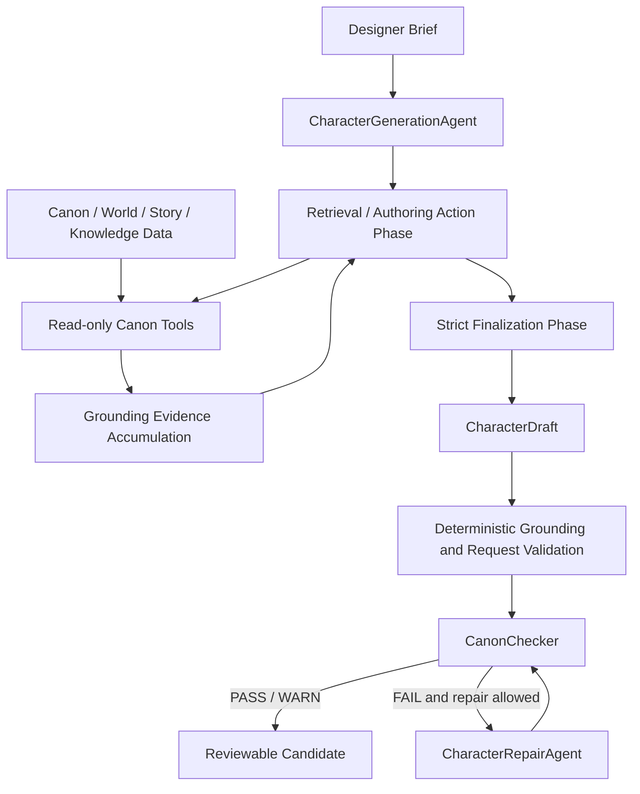

# Along the Street — Game AI Agent System

Along the Street is a structured game-content authoring system. Its current
Character Authoring milestone turns a designer brief into a reviewable,
Canon-grounded `CharacterDraft` through bounded retrieval, strict structured
finalization, deterministic validation, Canon checking, and bounded repair.
The agent proposes content; it does not write or approve formal Canon.

## Current Status

- **Public Release:** `v0.7.0 — Canon-Grounded Character Authoring` (latest public release)
- **Development Version:** `0.8.0.dev0`
- **Runtime Baseline:** `v0.6.6` — earlier frozen runtime milestone, not the current overall project version
- **Reference Corpus Baseline:** `v0.1` — independent namespace; frozen 10-record production baseline

## What This Project Is

Game designers need AI assistance without allowing a model to freely invent
world facts, overwrite established story data, or hide unsupported claims.
This repository explores that boundary with a small, auditable pipeline:

- Canon and world data remain read-only to the authoring agent.
- Existing Canon-dependent claims must be supported by successful retrieval.
- New character details are separated from established facts as proposal data.
- Deterministic runtime checks run before and after Canon checking and repair.
- Human review remains authoritative; a passing draft is not a Canon write.

This is more than “an LLM generates a game character.” It is a constrained
authoring workflow with explicit tool use, evidence accumulation, structured
contracts, failure handling, and evaluation.

## Why This Is More Than Prompt Engineering

The model is given a fixed, read-only authoring toolbox rather than direct
access to repositories or writable objects. Retrieval is permission-aware and
bounded. The final response is parsed as a strict `CharacterDraft` root
object, not an arbitrary wrapper or prose response. Deterministic checks then
validate IDs, grounding evidence, requested constraints, forbidden content,
and the separation between Canon and proposed design.

Canon Checker applies deterministic conflict rules without an LLM judge or
embedding-similarity decision. If a candidate violates the checker or allowed
repair scope, the repair loop may make at most one bounded attempt and then
re-check the result. Tool calls, sources, model invocations, and validation
outcomes are auditable.

## Current Architecture



Retrieval and final structured drafting are separate model phases. During the
retrieval/action phase, the model may call read-only tools or end with the
exact `FINALIZE` signal. The next model turn is the finalization phase: tools
are omitted and the model must return the strict `CharacterDraft` contract.

The phase split was introduced in commit `6b9f402`,
`feat: split character retrieval and finalization turns`.

The project separates these responsibilities:

- **Canon / world data** — structured world, faction, lore, character, and
  story information.
- **Knowledge / retrieval layer** — read-only scoped tools and permission-aware
  retrieval over that data.
- **Character Generation Agent** — converts a designer brief into a candidate
  `CharacterDraft`.
- **Grounding / constraint validation** — checks retrieved IDs, Canon Basis,
  requested constraints, forbidden content, and proposal boundaries.
- **Canon Checker** — checks the candidate against established Canon.
- **Character Repair Loop** — makes a bounded repair attempt when permitted.
- **Evaluation layer** — deterministic tests, benchmark cases, and live-model
  checks.
- **Reference Corpus** — external precedent/reference data for evaluation and
  authoring-quality analysis.

## Character Generation Flow

1. Receive a `CharacterDesignRequest` containing the brief, hard constraints,
   soft preferences, forbidden elements, and desired connections.
2. Enter the retrieval/action phase with a bounded default of six tool rounds.
3. Use a read-only Canon tool only when the brief depends on an existing
   faction, lore fact, character, world rule, story, case, or incident.
4. Accumulate source IDs and grounding evidence from successful tool results.
5. Stop early with `FINALIZE`, or finalize after the deterministic retrieval
   budget is exhausted.
6. Enter a tools-omitted finalization turn and parse the direct JSON root as a
   `CharacterDraft`.
7. Validate Canon IDs, grounding, request constraints, forbidden content, and
   proposal fields deterministically.
8. Run `CanonChecker`; if permitted, make at most one bounded repair attempt
   and perform a full re-check.

The result is a candidate for human review. It is never promoted to Canon by
this pipeline.

## Canon-Grounded Tooling

`CharacterAuthoringToolbox` exposes these fixed, read-only tools:

- Lore: `search_lore`, `get_lore`
- Factions: `search_factions`, `get_faction`
- Existing characters: `search_characters`, `get_character`
- World constraints: `get_world_rules`
- Story context: `search_story_context`, `get_story_context`

Searches return bounded safe summaries; detail calls retrieve one stable ID.
The toolbox supports authoring-visible scopes and does not expose the resolver,
repositories, filesystem paths, or write operations to the model.

## Example Live Run

One verified live end-to-end run used provider `opencode_go` with model
`deepseek-v4-flash`. The Canon-dependent brief required the generated
character to belong to an existing organization. The agent performed real
retrieval, selected `faction_005` (`临洲市公共安全联席体系`), and produced the
draft character `方宁舒`, whose occupation was
`临洲市公共安全联席体系大型活动安全组现场协作员`.

The draft had a non-empty retrieved source set and grounded Canon Basis
entries including `faction_005`, `lore_023`, `lore_024`, `lore_026`, and
`char_launch_007`. This is a verified live E2E example, not a benchmark or a
claim about universal model quality.

## Evaluation

The repository evaluates the boundaries around generation, not just whether
some text was produced:

- Full deterministic test suite: **583 passed, 1 skipped**.
- Character Generation tests: **43 passed**.
- Provider / adapter contract selection (`test_provider_contracts.py`,
  `test_openai_provider.py`, `test_live_llm_adapter.py`,
  `test_live_llm_errors.py`): **112 passed**.
- Character Generation deterministic evals: **13 passed, 0 failed**.
- Lean Character Generation Benchmark: cases **A–F all accepted**.

Coverage includes multi-round retrieval, finalization with tools omitted,
malformed response handling, pseudo-tool JSON rejection, unknown or fake Canon
IDs, grounding failures, forbidden content, bounded repair, and fail-closed
provider behavior. The small benchmark is an auditable fixture suite, not a
claim of general model performance.

Run the main checks with:

```bash
py -m pytest -q
py scripts/run_character_generation_evals.py
py -m pytest -q tests/test_character_generation_benchmark.py
py -m pytest -q tests/test_provider_contracts.py tests/test_openai_provider.py tests/test_live_llm_adapter.py tests/test_live_llm_errors.py
```

For an offline generation demo:

```bash
py scripts/demo_character_generation_v0_1.py --model offline
py scripts/demo_character_generation_v0_1.py --model offline --json
```

For the official end-to-end authoring demo:

```bash
py -m agents.official_character_authoring --scenario valid --model offline
py -m agents.official_character_authoring --scenario conflict --model offline
py -m agents.official_character_authoring --brief "设计一个新的都市辅助角色。" --model offline
```

See [Official Character Authoring Demo v0.1](docs/official_character_authoring_demo_v0.1.md).

Live mode uses the shared OpenAI-compatible transport. Configure
`NPC_LLM_PROVIDER`, `NPC_LLM_MODEL`, `NPC_LLM_API_KEY`, and related settings as
described in [the provider capability layer](docs/provider_capability_layer.md).

## Reference Corpus

The Reference Corpus Production Baseline v0.1 is frozen at 10 production
characters. Here, “production” refers to accepted and frozen corpus records, not production-readiness of the overall Agent system.
The corpus is a precedent, evaluation, and design-reference oracle for authoring-quality
analysis. It is not a few-shot answer bank, copying source, commercial
imitation dataset, or automatic template material.

The corpus is separate from runtime `data/characters/characters.yaml`, which
contains active world characters and may have a different record count.
Expansion is gap-driven: a concrete Generator, Canon, Repair, or evaluation
failure must show that the existing corpus lacks a useful precedent before a
new record is considered. See
[the production baseline](docs/reference_corpus/production_baseline_v0.1.md).

## Safety and Failure Boundaries

- Canon-dependent claims without successful retrieval grounding fail closed.
- Invented, unknown, or malformed Canon IDs are rejected.
- User text is not treated as Canon evidence.
- Pseudo-tool JSON is not treated as a real tool call.
- Finalization receives no tools; attempted finalization tool calls fail.
- Retrieval is bounded, and provider retries / loop exhaustion are bounded.
- Unsupported Canon claims fail validation or enter the bounded repair path;
  they do not silently pass.
- Repair cannot write Canon, approve a draft, escape its editable scope, or
  silently violate hard constraints.

## Current Status and Limitations

The earlier runtime baseline is documented separately as **Character Authoring
Pipeline v0.6.6**, with status `READY_FOR_DEMO`. The Reference Corpus production
baseline v0.1 is also frozen. Current work is centered on Agent quality,
evaluation, and demo readiness rather than speculative platform features.

Known limitations include imperfect Canon entity and alias resolution, a strict
extractive support contract for `canon_basis.supports`, retrieval efficiency,
and transient live-provider failures. The runtime fails closed for malformed
or exhausted provider interactions. These limits are recorded in
[the runtime freeze](docs/runtime_freeze_v0.6.6.md); planned work such as RAG,
memory, multi-agent orchestration, and Canon publishing is not implemented.

## Repository Layout

```text
src/agents/             Character generation, Canon checking, repair, providers
src/knowledge/          Scoped knowledge resolution and authorization
src/story/              Story and StoryState loading / validation
src/reference_corpus/   Reference-corpus models, loading, and validation
data/                   Canon, world, story, runtime characters, and corpus data
evals/                  Evaluation cases and fixtures
scripts/                Offline demos, validators, and evaluation runners
tests/                  Deterministic unit, integration, red-team, and corpus tests
docs/                   Freeze manifests, architecture notes, and milestone docs
```

## Roadmap / Known Boundaries

Near-term work is limited to improving authoring quality, evaluation depth,
retrieval efficiency, provider resilience, and demo presentation within the
existing boundaries. Canon approval/publishing, RAG, memory, planning,
multi-agent workflows, and a larger roster are future work, not current
capabilities.

## Further Reading

- [Character Generation Agent](docs/character_generation_agent_v0.1.md)
- [Runtime Freeze v0.6.6](docs/runtime_freeze_v0.6.6.md)
- [Canon Checker](docs/canon_checker_v0.1.md)
- [Character Repair Loop](docs/character_repair_loop_v0.1.md)
- [Provider Capability Layer](docs/provider_capability_layer.md)
- [Reference Corpus Production Baseline v0.1](docs/reference_corpus/production_baseline_v0.1.md)

## Acknowledgements

Special thanks to Duan Wenhua . Without your love and support, I would not have made it this far.
