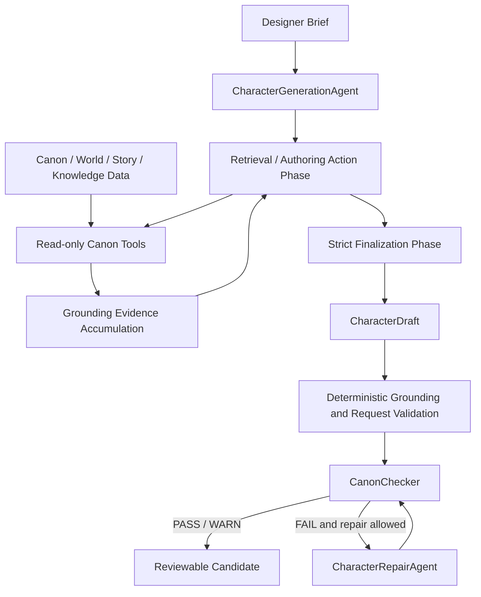

# Along the Street — Game AI Agent System

**English** | [简体中文](README.zh-CN.md)

[](https://github.com/glt258/game-ai-agent/actions/workflows/ci.yml)

Along the Street is a structured game-content authoring system. Its current
Character Authoring milestone turns a designer brief into a reviewable,
Canon-grounded `CharacterDraft` through bounded retrieval, strict structured
finalization, deterministic validation, Canon checking, and bounded repair.
The agent proposes content; it does not write, publish, or approve formal
Canon.

Character authoring supports age-ambiguous and diverse life-stage concepts
without forcing age-to-school/work mappings, while preserving Canon,
authority, and playable-role constraints.
The v0.3 authoring contract also preserves unknown exact, legal, and historical
age information, with school-history ambiguity kept separate from current
non-student status.

## Current Status

### Version Matrix

| Namespace | Current Identifier | Meaning |
|---|---|---|
| Project | `0.8.0` | Current release |
| Public Release | `v0.8` | Skill Design v1 and Manual Skill Playground release |
| Runtime Baseline | `runtime-v0.6.6` | Frozen runtime baseline |
| Reference Corpus | `reference-corpus-v0.5` | Current 16-record expanded corpus baseline |
| Character Intelligence | `CI-B1.5` | Current canonical combat-role compatibility milestone |
| Character Skill | `CS-S1.1` | Current frozen interface-design milestone |
| Skill Design | `CS-S2` | Skill Design v1 feature-frozen semantic coverage milestone |
| Hybrid Semantic IR | `hybrid-semantic-ir-e2e-v0.1` | Historical real-provider end-to-end evaluator PASS baseline |

The full naming policy is documented in [Versioning and Namespace Policy](docs/versioning.md).

Skill Design v1 is feature frozen under the documented seven-family semantic
coverage boundary. The release records offline pipeline verification and
bounded live observations; it does not claim universal first-pass model
reliability.

See [Skill Design v1 Feature Freeze](docs/character_generation/character_skill_design_v1_freeze_v1.0.md)
for the frozen architecture, evidence summary, known limitations, and deferred
v2 scope.

Release notes for `v0.8` are documented in
[docs/release_notes_v0.8.md](docs/release_notes_v0.8.md).

## What v0.8 Adds

- Skill Design v1 coverage for Support, Main DPS, Sub-DPS, Control,
  Reaction / Healer, Defense, and Basic Passive families.
- Semantic IR to deterministic compiler to canonical SkillKit and evaluator
  pipeline with reference-integrity checks.
- Manual Skill Playground CLI with natural-language requirements, role/mode,
  model selection, language selection, safe diagnostics, and one bounded
  repair opportunity.
- Simplified-Chinese and English human-readable playground output while
  machine-readable protocol fields remain authoritative English values.
- Generic triggered-v2 contract alignment and actor/effect-subject semantic
  constraints for generation and repair.

The release keeps deferred v2 mechanics, provider transport behavior, and
universal model reliability claims outside its scope.

## What This Project Is

Game designers need AI assistance without allowing a model to freely invent
world facts, overwrite established story data, or hide unsupported claims.
This repository explores that boundary with a small, auditable pipeline:

- Canon and world data remain read-only to the authoring agent.
- Existing Canon-dependent claims must be supported by successful retrieval.
- New character details are separated from established facts as proposal data.
- Deterministic runtime checks run before and after Canon checking and repair.
- Human review remains authoritative; a passing draft is not a Canon write.

This is more than “an LLM generates a game character.” It is a constrained
authoring workflow with explicit tool use, evidence accumulation, structured
contracts, failure handling, and evaluation.

## Why This Is More Than Prompt Engineering

The model is given a fixed, read-only authoring toolbox rather than direct
access to repositories or writable objects. Retrieval is permission-aware and
bounded. The final response is parsed as a strict `CharacterDraft` root
object, not an arbitrary wrapper or prose response. Deterministic checks then
validate IDs, grounding evidence, requested constraints, forbidden content,
and the separation between Canon and proposed design.

Canon Checker applies deterministic conflict rules without an LLM judge or
embedding-similarity decision. If a candidate violates the checker or allowed
repair scope, the repair loop may make at most one bounded attempt and then
re-check the result. Tool calls, sources, model invocations, and validation
outcomes are auditable.

## Current Architecture



Retrieval and final structured drafting are separate phases. The compatible
default `model_loop` strategy lets the model request bounded read-only tool
calls; the optional `deterministic` strategy plans the same safe retrieval
surface without changing grounding or validation rules. In either strategy,
the finalization turn has no tools and must return the strict `CharacterDraft`
contract.

The phase split was introduced in commit `6b9f402`,
`feat: split character retrieval and finalization turns`.

The project separates these responsibilities:

- **Canon / world data** — structured world, faction, lore, character, and
  story information.
- **Knowledge / retrieval layer** — read-only scoped tools and permission-aware
  retrieval over that data.
- **Character Generation Agent** — converts a designer brief into a candidate
  `CharacterDraft`.
- **Grounding / constraint validation** — checks retrieved IDs, Canon Basis,
  requested constraints, forbidden content, and proposal boundaries.
- **Canon Checker** — checks the candidate against established Canon.
- **Character Repair Loop** — makes a bounded repair attempt when permitted.
- **Evaluation layer** — deterministic tests, benchmark cases, and live-model
  checks.
- **Reference Corpus** — external precedent/reference data for evaluation and
  authoring-quality analysis.
- **Reference Selection Quality Benchmark v0.4** — offline ranking,
  sensitivity, concentration, stability, and corpus-coverage diagnostics.

## Character Generation Flow

1. Receive a `CharacterDesignRequest` containing the brief, hard constraints,
   soft preferences, forbidden elements, and desired connections.
2. Enter the bounded retrieval/action phase. The compatible default model loop
   allows at most six tool rounds; deterministic retrieval is available as an
   explicit strategy for controlled integrations.
3. Use a read-only Canon tool only when the brief depends on an existing
   faction, lore fact, character, world rule, story, case, or incident.
4. Accumulate source IDs and grounding evidence from successful tool results.
5. Stop early only with the exact `FINALIZE` signal. Malformed termination or
   exhausted action rounds fail closed and do not invoke unsafe finalization.
6. Enter a clean, tools-omitted finalization turn and parse the direct JSON
   root as a `CharacterDraft`.
7. Validate Canon IDs, grounding, request constraints, forbidden content, and
   proposal fields deterministically.
8. Run `CanonChecker`; if permitted, make at most one bounded repair attempt
   and perform a full re-check.
9. On any unsafe failure, return `NOT_COMPLETED` with no fabricated draft or
   Canon result. Structural CharacterDraft recovery is bounded and audited.

The result is a candidate for human review. It is never promoted to Canon by
this pipeline.

## Canon-Grounded Tooling

`CharacterAuthoringToolbox` exposes these fixed, read-only tools:

- Lore: `search_lore`, `get_lore`
- Factions: `search_factions`, `get_faction`
- Existing characters: `search_characters`, `get_character`
- World constraints: `get_world_rules`
- Story context: `search_story_context`, `get_story_context`

Searches return bounded safe summaries; detail calls retrieve one stable ID.
The toolbox supports authoring-visible scopes and does not expose the resolver,
repositories, filesystem paths, or write operations to the model.

## Live Observability

Live provider success is not the same as pipeline completion. A provider call
may succeed and the subsequent agent loop, finalization, grounding, or draft
validation may still fail. The failure renderer keeps that distinction visible:

```text
Provider invocation: SUCCESS
Outcome: success
Error: AgentExecutionError: <safe failure reason>
Pipeline status: NOT_COMPLETED
No Character draft or Canon result was fabricated.
```

Diagnostics may expose an exception category, a fixed safe reason, a grounding
check, and a validated Canon ID. They never expose API keys, provider response
bodies, full prompts, unprocessed model output, or unprocessed recovery
exception text.

## Validation and Evidence

### Verified Live Provider Run

One verified live Character Authoring E2E run used provider `opencode_go` with
model `deepseek-v4-flash`. The Canon-dependent brief required the generated
character to belong to an existing organization. The agent performed actual
retrieval, selected `faction_005` (`临洲市公共安全联席体系`), and produced the
draft character `方宁舒`, whose occupation was
`临洲市公共安全联席体系大型活动安全组现场协作员`.

The draft had a non-empty retrieved source set and grounded Canon Basis
entries including `faction_005`, `lore_023`, `lore_024`, `lore_026`, and
`char_launch_007`. This is one verified live E2E example, not a benchmark and
not a claim about universal model quality. Separate release probes found that
DeepSeek Pro full finalization can still exceed the existing bounded provider
attempts; that provider/model latency limitation remains intentionally visible.

### Historical Provider Evidence

The repository also preserves sanitized historical provider evidence from later
Character Skill / S2 / Hybrid Semantic IR investigations. It records bounded
structured-output and contract-compliance probes, shape diagnostics,
timeout/retry and latency observations, and Hybrid Semantic IR outcomes for
the investigated provider/model configurations. These observations came from
earlier provider runs; the committed copies are metadata-only fixtures under
[`tests/fixtures/historical_evidence/`](tests/fixtures/historical_evidence/)
used for reproducible validation. They do not cause new provider calls in CI
and are bounded experimental evidence, not a leaderboard or general model
benchmark.

### Hermetic End-to-End Validation

The Hybrid Semantic IR execution path supports an explicit provider-injection
seam, so tests can exercise the full provider → IR → validator → compiler →
parser → evaluator path with a deterministic injected provider. The
production/live default provider factory remains credential-gated:

```text
production/live path  → configured provider credentials required
hermetic CI path      → explicit injected provider; no real provider call
```

This seam exercises the execution path without weakening production provider
configuration or replacing live provider support.

### Clean-Checkout CI

The committed historical-evidence fixture store lets a clean public checkout
run without developer-local ignored `evals/results` artifacts. Production
evidence continues to use the normal `evals/results` path; test validators may
read the committed sanitized fixtures when those historical results are absent.
The fixture contract records that raw prompts, raw responses, IR payloads,
credentials, and other secrets are not stored.

Before this documentation update, the latest verified clean-checkout baseline
was main HEAD
`cafb72d29580b4d437f886926739703da8c9c545`, covered by [GitHub Actions run
#17](https://github.com/glt258/game-ai-agent/actions/runs/33238359141):
`quality`, Python 3.10/3.13/3.14 tests, `build`, `installed-smoke`, and
`ci-success` all passed, with `1602 passed, 1 skipped`. That CI validation
made 0 real provider calls: live smoke was disabled, credentials were absent,
and the Hybrid Semantic IR E2E path used explicit provider injection. Live
execution remains available separately when configured credentials are
provided.

## Evaluation

The repository evaluates the boundaries around generation, not just whether
some text was produced. The release gate covers the full deterministic test
suite, provider/adapter contracts, Canon and grounding regression cases,
negation-aware forbidden-pattern cases, recovery-audit secrecy checks, and
the SkillKit integration gates. CI also runs pre-commit checks, packaged-data
validation, distribution build checks, and installed-wheel smoke.

Coverage includes multi-round retrieval, optional deterministic retrieval,
clean finalization context, exact termination, malformed response handling,
pseudo-tool JSON rejection, unknown or fake Canon IDs, grounding failures,
negation-aware forbidden content, bounded repair, recovery diagnostics, and
fail-closed provider behavior. The fixture benchmarks are auditable regression
checks, not a claim of general model performance.

Run the main checks with:

```bash
.\.venv\Scripts\python.exe -m pytest -q
.\.venv\Scripts\python.exe scripts/run_character_generation_evals.py
.\.venv\Scripts\python.exe -m pytest -q tests/test_character_generation_benchmark.py
.\.venv\Scripts\python.exe -m pytest -q tests/test_provider_contracts.py tests/test_openai_provider.py tests/test_live_llm_adapter.py tests/test_live_llm_errors.py
```

### P2 local development quality checks

Install the development tools into the active virtual environment:

```powershell
py -m pip install -e ".[dev]"
```

Run the scoped quality checks and offline runtime smoke:

```powershell
py -m pre_commit run --all-files
py -m ruff check src/along_street_resources src/agents/official_character_authoring.py src/knowledge/loader.py src/reference_corpus/loader.py scripts/ci tests/test_ci_quality.py tests/test_cli_startup.py
py -m mypy src/along_street_resources scripts/ci
py scripts/ci/validate_runtime.py
py -m agents.official_character_authoring --scenario valid --model offline --json
```

Run the staged runtime-boundary coverage gate locally:

```powershell
py -m pytest tests/test_runtime_resources.py tests/test_story_state.py tests/test_knowledge_resolver.py tests/test_knowledge_resolver_integration.py tests/test_knowledge_registries.py tests/reference_corpus --cov=along_street_resources --cov=knowledge --cov=story --cov=reference_corpus --cov-branch --cov-report=term-missing --cov-report=xml
```

The fixed `tool.coverage.report.fail_under = 81` value gates the runtime
boundary modules (`along_street_resources`, `knowledge`, `story`, and
`reference_corpus`). The measured branch-coverage baseline is 82.25%; the
gate is its floored value minus one percentage point, not a moving runtime
calculation. The full suite still runs independently on every CI Python.
Build and inspect the release artifacts with:

```powershell
py -m build
py -m twine check dist/*
```

To run the installed-wheel smoke outside the checkout on Windows:

```powershell
$repoRoot = (Get-Location).Path
$smokeVenv = Join-Path $env:TEMP "along-street-smoke-venv"
$smokeCwd = Join-Path $env:TEMP "along-street-smoke-cwd"
py -m venv $smokeVenv
& "$smokeVenv\Scripts\python.exe" -m pip install (Get-ChildItem .\dist\*.whl).FullName
New-Item -ItemType Directory -Force $smokeCwd | Out-Null
Push-Location $smokeCwd
& "$smokeVenv\Scripts\python.exe" (Join-Path $repoRoot "scripts\ci\installed_smoke.py")
Pop-Location
```

### Windows install and wheel smoke

In PowerShell, create or activate a project virtual environment before using
the commands below.  A normal install builds and installs the package with its
runtime resources included:

```powershell
py -3.11 -m venv .venv
.\.venv\Scripts\Activate.ps1
.\.venv\Scripts\python.exe -m ensurepip --upgrade
.\.venv\Scripts\python.exe -m pip install .
```

To inspect the actual release artifact and verify it from outside the
repository checkout:

```powershell
.\.venv\Scripts\python.exe -m pip wheel . --no-deps --wheel-dir .\dist
.\.venv\Scripts\python.exe scripts\verify_wheel_runtime_resources.py `
  --wheel (Get-ChildItem .\dist\*.whl | Select-Object -First 1).FullName
```

The smoke verifier compares the wheel's resource set with the source set,
installs the wheel into an isolated target, changes to a non-repository CWD,
and calls the default Canon, story, reference-grounding, and deterministic
intent-parser entry points.  It also exercises explicit filesystem overrides.

The production CLI is registered by the PEP 621 `project.scripts` entry:

```powershell
.\.venv\Scripts\along-street-character-author.exe --scenario valid --model offline
```

The same production entry point can be run as a module:

```powershell
.\.venv\Scripts\python.exe -m agents.official_character_authoring --scenario valid --model offline
```

The legacy source-script commands remain supported for demos and evaluations:

```powershell
.\.venv\Scripts\python.exe scripts/demo_character_generation_v0_1.py --model offline --json
.\.venv\Scripts\python.exe scripts/demo_canon_checker_v0_1.py --case good --json
.\.venv\Scripts\python.exe scripts/demo_character_repair_v0_1.py --case pass --model offline --json
.\.venv\Scripts\python.exe scripts/run_canon_checker_evals.py
.\.venv\Scripts\python.exe scripts/run_canon_checker_live_language_evals.py
.\.venv\Scripts\python.exe scripts/run_canon_checker_redteam.py
.\.venv\Scripts\python.exe scripts/run_character_generation_evals.py
.\.venv\Scripts\python.exe scripts/run_character_repair_evals.py
.\.venv\Scripts\python.exe scripts/run_character_repair_redteam.py
```

For an offline generation demo:

```bash
.\.venv\Scripts\python.exe scripts/demo_character_generation_v0_1.py --model offline
.\.venv\Scripts\python.exe scripts/demo_character_generation_v0_1.py --model offline --json
```

For the official end-to-end authoring demo:

```bash
.\.venv\Scripts\python.exe -m agents.official_character_authoring --scenario valid --model offline
.\.venv\Scripts\python.exe -m agents.official_character_authoring --scenario conflict --model offline
.\.venv\Scripts\python.exe -m agents.official_character_authoring --brief "设计一个新的都市辅助角色。" --model offline
```

See [Official Character Authoring Demo v0.1](docs/official_character_authoring_demo_v0.1.md).

The offline commands are deterministic regression demonstrations. For a live
authoring run with a fresh brief, configure `NPC_LLM_API_KEY` and
`NPC_LLM_MODEL`, then run:

```bash
.\.venv\Scripts\python.exe -m agents.official_character_authoring --brief-file .\demo_brief.txt --model live
```

Use `--provider` and `--model-name` for one-off live overrides. Live
configuration or provider failures are reported as `NOT_COMPLETED`; the CLI
does not fall back to the offline fixture or fabricate a Canon result.

Live mode uses the shared OpenAI-compatible transport. Configure
`NPC_LLM_PROVIDER`, `NPC_LLM_MODEL`, `NPC_LLM_API_KEY`, and related settings as
described in [the provider capability layer](docs/provider_capability_layer.md).

## Reference Corpus

The Reference Corpus baseline `reference-corpus-v0.5` is frozen at 16 production
characters. Here, “production” refers to accepted and frozen corpus records, not production-readiness of the overall Agent system.
The corpus is a precedent, evaluation, and design-reference oracle for authoring-quality
analysis. It is not a few-shot answer bank, copying source, commercial
imitation dataset, or automatic template material.

The corpus is packaged with the other runtime resources under
`src/along_street_resources/data/reference_corpus/`; it is separate from the
active world-character records under
`src/along_street_resources/data/characters/characters.yaml`.

The production boundary is declared by
`src/along_street_resources/data/reference_corpus/characters/_catalog/corpus_manifest.yaml`.
Manifest schema `character-reference-corpus-manifest/0.2` records the frozen
baseline ID, record schema versions, games, and exact record ID-to-directory
paths. `games.yaml` is the production game catalog and retains only the five
commercial games; synthetic test games live in
`tests/reference_corpus/fixtures/test_games.yaml`.

`CharacterReferenceRepository` uses `manifest_policy="required"` by default:
it verifies the filesystem collection and loads only the declared records.
Temporary synthetic or external corpora without a manifest must opt into
`manifest_policy="unmanaged"`; that mode preserves directory scanning and
cannot be combined with an explicit manifest. The superseded fixture planning
file remains loadable at
`docs/reference_corpus/archive/fixture_plan_v0.1.yaml` and is not a packaged
runtime resource.

Expansion is gap-driven: a concrete Generator, Canon, Repair, or evaluation
failure must show that the existing corpus lacks a useful precedent before a
new record is considered. See
[the production baseline](docs/reference_corpus/production_baseline_v0.1.md).

All runtime data is maintained in the single
`src/along_street_resources/data/` tree.  Production code resolves packaged
resources through `along_street_resources.data_root()` and
`along_street_resources.data_resource(...)`, which return Python 3.10-compatible
`Traversable` objects and do not depend on the checkout CWD.  Use an explicit
`Path` only when a caller intentionally supplies an external data or corpus
directory, for example `load_canon(data_dir=path)`,
`load_story_repository(data_dir=path)`, or
`load_reference_grounding(brief, corpus_root=path)`.

## Safety and Failure Boundaries

- Canon-dependent claims without successful retrieval grounding fail closed.
- Invented, unknown, or malformed Canon IDs are rejected.
- User text is not treated as Canon evidence.
- Pseudo-tool JSON is not treated as a real tool call.
- Finalization receives no tools; attempted finalization tool calls fail.
- Retrieval is bounded, and provider retries / loop exhaustion are bounded.
- Live failure diagnostics retain only sanitized provider/model metadata and
  allowlisted failure details.
- Negated forbidden-pattern statements are evaluated deterministically; a
  positive forbidden institution or authority claim still fails Canon checks.
- Unsupported Canon claims fail validation or enter the bounded repair path;
  they do not silently pass.
- Repair cannot write Canon, approve a draft, escape its editable scope, or
  silently violate hard constraints.

## Current Status and Limitations

The earlier runtime baseline is documented separately as **Character Authoring
Pipeline runtime-v0.6.6**, with status `READY_FOR_DEMO`. The current expanded
Reference Corpus baseline is `reference-corpus-v0.5`; the historical production
baseline v0.1 is also frozen. Current work is centered on Agent quality,
evaluation, and demo readiness rather than speculative platform features.

Known limitations include imperfect Canon entity and alias resolution, a strict
extractive support contract for `canon_basis.supports`, retrieval efficiency,
and transient live-provider failures. DeepSeek Pro full finalization can still
time out under the existing provider bounds. The runtime fails closed for
malformed or exhausted provider interactions. These limits are recorded in
[the runtime freeze](docs/runtime_freeze_v0.6.6.md); planned work such as RAG,
memory, multi-agent orchestration, and Canon publishing is not implemented.

## Repository Layout

```text
src/agents/             Character generation, Canon checking, repair, providers
src/knowledge/          Scoped knowledge resolution and authorization
src/story/              Story and StoryState loading / validation
src/reference_corpus/   Reference-corpus models, loading, and validation
src/along_street_resources/data/
                        Packaged Canon, world, story, character, and corpus data
evals/                  Evaluation cases and fixtures
scripts/                Offline demos, validators, and evaluation runners
tests/                  Deterministic unit, integration, red-team, and corpus tests
docs/                   Freeze manifests, architecture notes, and milestone docs
```

## Roadmap / Known Boundaries

Near-term work is limited to improving authoring quality, evaluation depth,
retrieval efficiency, provider resilience, and demo presentation within the
existing boundaries. Canon approval/publishing, RAG, memory, planning,
multi-agent workflows, and a larger roster are future work, not current
capabilities.

## Further Reading

- [Character Generation Agent](docs/character_generation_agent_v0.1.md)
- [Runtime Freeze runtime-v0.6.6](docs/runtime_freeze_v0.6.6.md)
- [Canon Checker](docs/canon_checker_v0.1.md)
- [Character Repair Loop](docs/character_repair_loop_v0.1.md)
- [Provider Capability Layer](docs/provider_capability_layer.md)
- [v0.7.1 Release Notes](docs/release_notes_v0.7.1.md)
- [v0.7.1 Release Scope](docs/v0.7.1_release_scope.md)
- [Reference Corpus Production Baseline v0.1](docs/reference_corpus/production_baseline_v0.1.md)
- [Reference Corpus Baseline reference-corpus-v0.5](docs/reference_corpus_expanded_baseline_v0.5.md)

## Acknowledgements

Special thanks to Duan Wenhua . Without your love and support, I would not have made it this far.
