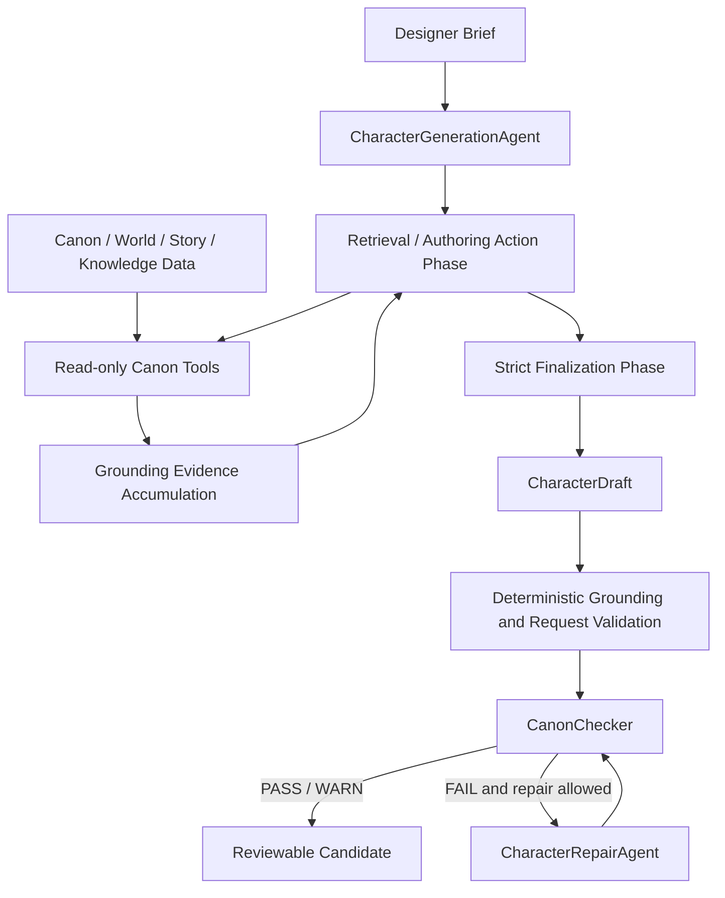

# Along the Street — 游戏 AI Agent 系统

[English](README.md) | **简体中文**

[](https://github.com/glt258/game-ai-agent/actions/workflows/ci.yml)

Along the Street 是一个结构化的游戏内容创作系统。当前的 Character
Authoring 里程碑通过有界检索、严格的结构化定稿、确定性校验、Canon 检查和有界修复，
将设计师简述转换为可审核、以 Canon 为依据的 `CharacterDraft`。
Agent 提议内容；它不会写入、发布或批准正式 Canon。

角色创作支持年龄含混和多样人生阶段的概念，不强制建立年龄与学校/工作之间的对应关系，
同时保留 Canon、权限以及可玩角色约束。
v0.3 创作契约还会保留未知的精确年龄、法定年龄和历史年龄信息，
并将就学经历含混与当前非学生状态分开处理。

## 当前状态

### 版本矩阵

| 命名空间 | 当前标识 | 含义 |
|---|---|---|
| Project | `0.7.1` | 当前版本 |
| Public Release | `v0.7.1` | 当前线上创作安全与诊断版本 |
| Runtime Baseline | `runtime-v0.6.6` | 冻结的运行时基线 |
| Reference Corpus | `reference-corpus-v0.5` | 当前包含 16 条记录的扩展语料库基线 |
| Character Intelligence | `CI-B1.5` | 当前 Canon 化战斗角色兼容性里程碑 |
| Character Skill | `CS-S1.1` | 当前冻结的接口设计里程碑 |

完整的命名策略记录于 [Versioning and Namespace Policy](docs/versioning.md)。

`v0.7.1` 的发布说明记录于
[docs/release_notes_v0.7.1.md](docs/release_notes_v0.7.1.md)。

## v0.7.1 新增内容

- 失败即关闭（fail-closed）的 Live 失败渲染，包含安全失败类型、有界原因、调用结果、
  grounding 检查以及允许列表中的 Canon ID。
- 严格的定稿终止：只有精确的 `FINALIZE` 信号才会结束检索/动作循环；耗尽或格式错误的循环
  不会伪造 draft。
- 从请求和已校验证据构建干净的定稿上下文，不会将检索工具历史重放到定稿请求中。
- 针对受支持的中文否定表达，加入具备否定感知能力的确定性 Canon 禁止模式匹配；
  同时仍会拒绝正面的 RULE-008 违规。
- 对 `CharacterDraft` 契约恢复进行脱敏审计，绝不复制原始 provider 响应、提示词、模型输出或秘密。

该版本保持 grounding、CharacterDraft 校验、Canon Checker、有界 Repair、provider 重试行为
以及失败即关闭边界不变。

## 这个项目是什么

游戏设计师需要 AI 协助，但不能允许模型自由编造世界事实、覆盖既有故事数据或隐藏未经支持的声明。
本仓库通过一个小型、可审计的流水线探索这一边界：

- Canon 和世界数据对创作 Agent 保持只读。
- 现有的、依赖 Canon 的声明必须由成功的检索提供支持。
- 新角色细节与既有事实分开，作为提议数据处理。
- 确定性运行时检查会在 Canon 检查和修复之前及之后执行。
- 人工审核仍拥有最终权威；通过校验的 draft 不等于写入 Canon。

这不只是“让 LLM 生成游戏角色”。这是一个具备显式工具使用、证据积累、结构化契约、失败处理和评估能力的
受约束创作工作流。

## 为什么这不只是提示词工程

模型获得的是固定且只读的创作工具箱，而不是对仓库或可写对象的直接访问权限。
检索具备权限感知能力并受到边界限制。最终响应会被解析为严格的 `CharacterDraft` 根对象，
而不是任意包装器或文本响应。随后，确定性检查会校验 ID、grounding 证据、请求约束、禁止内容，
以及 Canon 与提议设计之间的分离。

Canon Checker 应用确定性的冲突规则，不使用 LLM 判定器或嵌入相似度决策。
如果候选违反检查器或允许的修复范围，修复循环最多可以进行一次有界尝试，随后重新检查结果。
工具调用、来源、模型调用和校验结果都可审计。

## 当前架构



检索与最终结构化 draft 是两个独立阶段。兼容的默认 `model_loop` 策略允许模型请求有界的只读工具调用；
可选的 `deterministic` 策略会在不改变 grounding 或校验规则的情况下，规划同一安全检索面。
无论采用哪种策略，定稿轮次都不提供工具，并且必须返回严格的 `CharacterDraft` 契约。

阶段拆分是在提交 `6b9f402`、
`feat: split character retrieval and finalization turns` 中引入的。

项目将以下职责分开：

- **Canon / 世界数据** — 结构化的世界、阵营、传说、角色和故事信息。
- **Knowledge / 检索层** — 对这些数据执行只读、限定范围且具备权限感知的检索工具。
- **Character Generation Agent** — 将设计师简述转换为候选 `CharacterDraft`。
- **Grounding / 约束校验** — 检查检索到的 ID、Canon Basis、请求约束、禁止内容和提议边界。
- **Canon Checker** — 根据既有 Canon 检查候选。
- **Character Repair Loop** — 在允许时进行一次有界修复尝试。
- **Evaluation layer** — 确定性测试、基准用例和 live-model 检查。
- **Reference Corpus** — 用于评估和创作质量分析的外部先例/参考数据。
- **Reference Selection Quality Benchmark v0.4** — 离线排序、敏感性、集中度、稳定性和语料库覆盖率诊断。

## 角色生成流程

1. 接收包含简述、硬约束、软偏好、禁止元素和期望关联的 `CharacterDesignRequest`。
2. 进入有界检索/动作阶段。兼容的默认模型循环最多允许六轮工具调用；
   确定性检索可作为受控集成的显式策略使用。
3. 只有当简述依赖既有阵营、传说事实、角色、世界规则、故事、案件或事件时，才使用只读 Canon 工具。
4. 从成功的工具结果中积累来源 ID 和 grounding 证据。
5. 只有收到精确的 `FINALIZE` 信号时才提前停止。格式错误的终止或动作轮次耗尽会失败即关闭，
   不会调用不安全的定稿流程。
6. 进入不提供工具的干净定稿轮次，并将直接 JSON 根解析为 `CharacterDraft`。
7. 以确定性方式校验 Canon ID、grounding、请求约束、禁止内容和提议字段。
8. 运行 `CanonChecker`；如果允许，则最多进行一次有界修复尝试，并完整重新检查。
9. 任何不安全失败都会返回 `NOT_COMPLETED`，不伪造 draft 或 Canon 结果。结构化 CharacterDraft 恢复受到有界控制并经过审计。

结果是供人工审核的候选。它永远不会通过该流水线提升为 Canon。

## 基于 Canon 的工具能力

`CharacterAuthoringToolbox` 暴露以下固定的只读工具：

- Lore：`search_lore`、`get_lore`
- Factions：`search_factions`、`get_faction`
- Existing characters：`search_characters`、`get_character`
- World constraints：`get_world_rules`
- Story context：`search_story_context`、`get_story_context`

搜索会返回有界的安全摘要；详情调用会检索一个稳定 ID。
工具箱支持面向创作的作用域，不会向模型暴露 resolver、仓库、文件系统路径或写操作。

## Live 可观测性

Live provider 成功不等同于流水线完成。provider 调用可能成功，但后续的 Agent 循环、定稿、grounding 或 draft 校验
仍可能失败。失败渲染器会保留这种区别：

```text
Provider invocation: SUCCESS
Outcome: success
Error: AgentExecutionError: <safe failure reason>
Pipeline status: NOT_COMPLETED
No Character draft or Canon result was fabricated.
```

诊断信息可能暴露异常类别、固定的安全原因、grounding 检查和经过校验的 Canon ID。
它们绝不会暴露 API key、provider 响应正文、完整提示词、未经处理的模型输出或未经处理的恢复异常文本。

## Live 运行示例

一次经过验证的 live 端到端运行使用了 provider `opencode_go` 和模型 `deepseek-v4-flash`。
该依赖 Canon 的简述要求生成的角色属于一个既有组织。Agent 执行了真实检索，选择了 `faction_005`
（`临洲市公共安全联席体系`），并生成了角色 `方宁舒`，其职业为
`临洲市公共安全联席体系大型活动安全组现场协作员`。

该 draft 具有非空的检索来源集合，grounded Canon Basis 条目包括 `faction_005`、`lore_023`、`lore_024`、
`lore_026` 和 `char_launch_007`。这是经过验证的 live E2E 示例，并不是基准测试，也不是关于模型普遍质量的声明。
独立的发布探针发现，DeepSeek Pro 的完整定稿仍可能超过现有的有界 provider 尝试次数；
该 provider/模型延迟限制被 v0.7.1 有意保留，未被隐藏或改变。

## 评估

本仓库评估的是生成周围的边界，而不只是是否生成了某些文本。发布门禁覆盖完整的确定性测试套件、
provider/adapter 契约、Canon 与 grounding 回归用例、具备否定感知的禁止模式用例、恢复审计保密性检查以及 SkillKit 集成门禁。
CI 还会运行 pre-commit 检查、打包数据校验、分发构建检查和已安装 wheel 的 smoke 测试。

覆盖范围包括多轮检索、可选的确定性检索、干净的定稿上下文、精确终止、格式错误的响应处理、伪工具 JSON 拒绝、
未知或伪造的 Canon ID、grounding 失败、具备否定感知的禁止内容、有界修复、恢复诊断以及 provider 的失败即关闭行为。
fixture 基准是可审计的回归检查，并不代表一般模型性能。

使用以下命令运行主要检查：

```bash
.\.venv\Scripts\python.exe -m pytest -q
.\.venv\Scripts\python.exe scripts/run_character_generation_evals.py
.\.venv\Scripts\python.exe -m pytest -q tests/test_character_generation_benchmark.py
.\.venv\Scripts\python.exe -m pytest -q tests/test_provider_contracts.py tests/test_openai_provider.py tests/test_live_llm_adapter.py tests/test_live_llm_errors.py
```

### P2 本地开发质量检查

将开发工具安装到当前虚拟环境：

```powershell
py -m pip install -e ".[dev]"
```

运行限定范围的质量检查和离线运行时 smoke 测试：

```powershell
py -m pre_commit run --all-files
py -m ruff check src/along_street_resources src/agents/official_character_authoring.py src/knowledge/loader.py src/reference_corpus/loader.py scripts/ci tests/test_ci_quality.py tests/test_cli_startup.py
py -m mypy src/along_street_resources scripts/ci
py scripts/ci/validate_runtime.py
py -m agents.official_character_authoring --scenario valid --model offline --json
```

在本地运行已暂存的运行时边界覆盖率门禁：

```powershell
py -m pytest tests/test_runtime_resources.py tests/test_story_state.py tests/test_knowledge_resolver.py tests/test_knowledge_resolver_integration.py tests/test_knowledge_registries.py tests/reference_corpus --cov=along_street_resources --cov=knowledge --cov=story --cov=reference_corpus --cov-branch --cov-report=term-missing --cov-report=xml
```

固定的 `tool.coverage.report.fail_under = 81` 值会对运行时边界模块
（`along_street_resources`、`knowledge`、`story` 和 `reference_corpus`）设定门禁。
实测分支覆盖率基线为 82.25%；门禁是其向下取整值减去一个百分点，而不是动态的运行时计算结果。
完整套件仍会在每个 CI Python 版本上独立运行。
使用以下命令构建并检查发布产物：

```powershell
py -m build
py -m twine check dist/*
```

在 Windows 上从 checkout 外部运行已安装 wheel 的 smoke 测试：

```powershell
$repoRoot = (Get-Location).Path
$smokeVenv = Join-Path $env:TEMP "along-street-smoke-venv"
$smokeCwd = Join-Path $env:TEMP "along-street-smoke-cwd"
py -m venv $smokeVenv
& "$smokeVenv\Scripts\python.exe" -m pip install (Get-ChildItem .\dist\*.whl).FullName
New-Item -ItemType Directory -Force $smokeCwd | Out-Null
Push-Location $smokeCwd
& "$smokeVenv\Scripts\python.exe" (Join-Path $repoRoot "scripts\ci\installed_smoke.py")
Pop-Location
```

### Windows 安装和 wheel smoke

在 PowerShell 中，先创建或激活项目虚拟环境，再使用以下命令。普通安装会构建并安装包含运行时资源的软件包：

```powershell
py -3.11 -m venv .venv
.\.venv\Scripts\Activate.ps1
.\.venv\Scripts\python.exe -m ensurepip --upgrade
.\.venv\Scripts\python.exe -m pip install .
```

从仓库 checkout 外部检查实际发布产物并验证：

```powershell
.\.venv\Scripts\python.exe -m pip wheel . --no-deps --wheel-dir .\dist
.\.venv\Scripts\python.exe scripts\verify_wheel_runtime_resources.py `
  --wheel (Get-ChildItem .\dist\*.whl | Select-Object -First 1).FullName
```

smoke verifier 会将 wheel 的资源集合与源代码集合进行比较，将 wheel 安装到隔离目标目录，切换到非仓库 CWD，
并调用默认的 Canon、story、reference-grounding 和 deterministic intent-parser 入口点。
它还会测试显式的文件系统覆盖项。

生产 CLI 由 PEP 621 的 `project.scripts` 条目注册：

```powershell
.\.venv\Scripts\along-street-character-author.exe --scenario valid --model offline
```

同一个生产入口点也可以作为模块运行：

```powershell
.\.venv\Scripts\python.exe -m agents.official_character_authoring --scenario valid --model offline
```

旧版源脚本命令仍支持 demo 和评估：

```powershell
.\.venv\Scripts\python.exe scripts/demo_character_generation_v0_1.py --model offline --json
.\.venv\Scripts\python.exe scripts/demo_canon_checker_v0_1.py --case good --json
.\.venv\Scripts\python.exe scripts/demo_character_repair_v0_1.py --case pass --model offline --json
.\.venv\Scripts\python.exe scripts/run_canon_checker_evals.py
.\.venv\Scripts\python.exe scripts/run_canon_checker_live_language_evals.py
.\.venv\Scripts\python.exe scripts/run_canon_checker_redteam.py
.\.venv\Scripts\python.exe scripts/run_character_generation_evals.py
.\.venv\Scripts\python.exe scripts/run_character_repair_evals.py
.\.venv\Scripts\python.exe scripts/run_character_repair_redteam.py
```

运行离线生成 demo：

```bash
.\.venv\Scripts\python.exe scripts/demo_character_generation_v0_1.py --model offline
.\.venv\Scripts\python.exe scripts/demo_character_generation_v0_1.py --model offline --json
```

运行官方端到端创作 demo：

```bash
.\.venv\Scripts\python.exe -m agents.official_character_authoring --scenario valid --model offline
.\.venv\Scripts\python.exe -m agents.official_character_authoring --scenario conflict --model offline
.\.venv\Scripts\python.exe -m agents.official_character_authoring --brief "设计一个新的都市辅助角色。" --model offline
```

参见 [Official Character Authoring Demo v0.1](docs/official_character_authoring_demo_v0.1.md)。

离线命令是确定性的回归演示。要使用新的简述运行 live 创作，请配置 `NPC_LLM_API_KEY` 和
`NPC_LLM_MODEL`，然后运行：

```bash
.\.venv\Scripts\python.exe -m agents.official_character_authoring --brief-file .\demo_brief.txt --model live
```

可以使用 `--provider` 和 `--model-name` 进行一次性的 live 覆盖。Live 配置或 provider 失败会报告为
`NOT_COMPLETED`；CLI 不会回退到离线 fixture，也不会伪造 Canon 结果。

Live 模式使用共享的 OpenAI 兼容传输层。请按照[provider capability layer](docs/provider_capability_layer.md)
中的说明配置 `NPC_LLM_PROVIDER`、`NPC_LLM_MODEL`、`NPC_LLM_API_KEY` 及相关设置。

## Reference Corpus

Reference Corpus 基线 `reference-corpus-v0.5` 已冻结为 16 个生产角色。
这里的“生产”指已接受并冻结的语料库记录，并不表示整个 Agent 系统已经具备生产就绪状态。
该语料库是用于创作质量分析的先例、评估和设计参考 oracle。
它不是 few-shot 答案库、源代码复制数据、商业模仿数据集或自动模板素材。

语料库与其他运行时资源一起打包在
`src/along_street_resources/data/reference_corpus/` 下；它与
`src/along_street_resources/data/characters/characters.yaml` 中的活动世界角色记录分开。

生产边界由
`src/along_street_resources/data/reference_corpus/characters/_catalog/corpus_manifest.yaml` 声明。
清单 schema `character-reference-corpus-manifest/0.2` 记录冻结基线 ID、记录 schema 版本、游戏以及精确的记录 ID 到目录路径映射。
`games.yaml` 是生产游戏目录，仅保留五款商业游戏；合成测试游戏位于
`tests/reference_corpus/fixtures/test_games.yaml`。

`CharacterReferenceRepository` 默认使用 `manifest_policy="required"`：
它会校验文件系统集合，并且只加载声明的记录。没有清单的临时合成或外部语料库必须选择
`manifest_policy="unmanaged"`；该模式保留目录扫描，且不能与显式清单结合使用。
已被取代的 fixture 规划文件仍可从
`docs/reference_corpus/archive/fixture_plan_v0.1.yaml` 加载，并不是打包的运行时资源。

扩展以缺口为驱动：只有具体的 Generator、Canon、Repair 或评估失败表明现有语料库缺少有用先例时，
才会考虑新增记录。参见[生产基线](docs/reference_corpus/production_baseline_v0.1.md)。

所有运行时数据都维护在统一的
`src/along_street_resources/data/` 树中。生产代码通过 `along_street_resources.data_root()` 和
`along_street_resources.data_resource(...)` 解析打包资源；它们返回兼容 Python 3.10 的 `Traversable` 对象，
不依赖 checkout CWD。当调用方有意提供外部数据或语料库目录时，才使用显式的 `Path`，例如
`load_canon(data_dir=path)`、`load_story_repository(data_dir=path)` 或
`load_reference_grounding(brief, corpus_root=path)`。

## 安全性和失败边界

- 未经成功检索 grounding 的 Canon 依赖声明会失败即关闭。
- 虚构、未知或格式错误的 Canon ID 会被拒绝。
- 用户文本不会被当作 Canon 证据。
- 伪工具 JSON 不会被当作真实工具调用。
- 定稿阶段不接收工具；尝试在定稿阶段调用工具会失败。
- 检索受到边界限制，provider 重试和循环耗尽也受到边界限制。
- Live 失败诊断只保留经过脱敏的 provider/model 元数据和允许列表中的失败细节。
- 否定的禁止模式陈述会以确定性方式评估；正面的禁止机构或权威声明仍会使 Canon 检查失败。
- 不受支持的 Canon 声明会校验失败或进入有界修复路径；不会静默通过。
- Repair 不能写入 Canon、批准 draft、逃出其可编辑范围或静默违反硬约束。

## 当前状态和限制

较早的运行时基线另行记录为 **Character Authoring Pipeline runtime-v0.6.6**，状态为 `READY_FOR_DEMO`。
当前扩展的 Reference Corpus 基线为 `reference-corpus-v0.5`；历史生产基线 v0.1 也已冻结。
当前工作重点是 Agent 质量、评估和 demo 就绪度，而不是推测性的平台功能。

已知限制包括不完善的 Canon 实体和别名解析、对 `canon_basis.supports` 的严格抽取式支持契约、
检索效率以及瞬时的 live-provider 失败。DeepSeek Pro 的完整定稿在现有 provider 边界下仍可能超时。
对于格式错误或耗尽的 provider 交互，运行时会失败即关闭。这些限制记录在[运行时冻结](docs/runtime_freeze_v0.6.6.md)中；
RAG、memory、多 Agent 编排和 Canon 发布等计划中的工作尚未实现。

## 仓库布局

```text
src/agents/             Character generation, Canon checking, repair, providers
src/knowledge/          Scoped knowledge resolution and authorization
src/story/              Story and StoryState loading / validation
src/reference_corpus/   Reference-corpus models, loading, and validation
src/along_street_resources/data/
                        Packaged Canon, world, story, character, and corpus data
evals/                  Evaluation cases and fixtures
scripts/                Offline demos, validators, and evaluation runners
tests/                  Deterministic unit, integration, red-team, and corpus tests
docs/                   Freeze manifests, architecture notes, and milestone docs
```

## 路线图 / 已知边界

近期工作仅限于在现有边界内改进创作质量、评估深度、检索效率、provider 稳健性和 demo 呈现。
Canon 批准/发布、RAG、memory、规划、多 Agent 工作流和更大的角色阵容属于未来工作，不是当前能力。

## 延伸阅读

- [Character Generation Agent](docs/character_generation_agent_v0.1.md)
- [Runtime Freeze runtime-v0.6.6](docs/runtime_freeze_v0.6.6.md)
- [Canon Checker](docs/canon_checker_v0.1.md)
- [Character Repair Loop](docs/character_repair_loop_v0.1.md)
- [Provider Capability Layer](docs/provider_capability_layer.md)
- [v0.7.1 Release Notes](docs/release_notes_v0.7.1.md)
- [v0.7.1 Release Scope](docs/v0.7.1_release_scope.md)
- [Reference Corpus Production Baseline v0.1](docs/reference_corpus/production_baseline_v0.1.md)
- [Reference Corpus Baseline reference-corpus-v0.5](docs/reference_corpus_expanded_baseline_v0.5.md)

## 致谢

特别感谢段文华。没有你的爱与支持，我不会走到今天。
