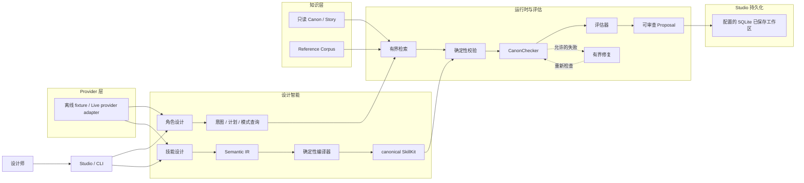

# Game AI Agent

**结构化的 AI 辅助游戏内容设计与创作系统**

[English](README.md) | **简体中文**

[](https://github.com/glt258/game-ai-agent/actions/workflows/ci.yml)

Game AI Agent 正在构建一个面向游戏开发的结构化 AI 内容设计系统。它不是
Prompt wrapper，也还不是完整的 AI 原生游戏开发平台。当前重点是角色与技能
设计、基于 Canon 的检索、确定性校验、评估，以及本地 Studio 工作流。

项目长期方向是更广泛的游戏内容开发。当前模型输出是 proposal，创作流程对
Canon 只读，最终审查权属于人类。

## 当前能做什么

- 将设计师 brief 转换为结构化、可审查的 `CharacterDraft`。
- 通过有界、只读的 Canon 与 Story 检索支撑角色创作。
- 结构化设计意图，并从 Reference Corpus 检索设计先例。
- 通过 Semantic IR、确定性编译、canonical `SkillKit`、评估、安全诊断和
  有界语义修复进行技能设计。
- 执行请求、表示、Canon、grounding 和 contract 检查，并审计工具与模型调用。
- 使用本地 Next.js + FastAPI Studio，包括基于 SQLite 的已保存角色工作区。

## 当前能力

### 角色设计与创作

```text
设计师 Brief → 意图 / 计划 → 有界 Canon 检索
  → CharacterDraft 生成 → 确定性校验 → CanonChecker
  → 最多一次获准修复 → 人工审查
```

`CharacterDraft` 是待审查的 proposal，不是批准结果，也不会写入 Canon。创作
工具箱只提供白名单内的 lore、faction、character、world-rule 和 story 查询；
模型不能访问任意文件或写入操作。

### 角色设计智能

`CharacterDesignIntent`、`CharacterDesignPlan` 和 `DesignPatternQuery` 将 brief
投影为结构化设计信息。确定性的 reference selector 寻找相关先例与对比候选。
它们是设计辅助，不是隐藏思维链，也不是第二套角色 schema。

### 技能设计

Skill Design v1（`CS-S2`）支持 Main DPS、Sub-DPS、Support、Healer/Reaction、
Control、Defense 和 Basic Passive 七类语义：

```text
需求 / 上下文 → Semantic IR → IR 校验
  → 确定性编译器 → canonical SkillKit → parser / 引用完整性
  → evaluator → 安全诊断
```

已通过校验的 IR 在 evaluator 失败后最多修复一次。provider、解析、编译和引用
完整性失败不会被悄悄变成成功；v2 机制不在当前范围内，详见 [Skill Design v1 冻结说明](docs/character_generation/character_skill_design_v1_freeze_v1.0.md)。

### Canon、知识与 Reference Corpus

- `src/knowledge/` 与打包资源提供 default-deny、只读的 Canon、world、faction、
  lore、character、case、incident、project 和 story 访问。
- `CanonChecker` 确定性地检查冲突、权限、grounding、知识范围和硬约束。
- `reference-corpus-v0.5` 是冻结基线，包含用于设计先例与评估的 facts、sources
  和 analysis。

Reference Corpus 不是 copy bank、few-shot answer bank、商业模仿数据集或 Canon
权威。selector 有界且确定性；其选择指标不代表生成质量提升。

顶层 `knowledge/` 是 Engineering Knowledge Layer 和 Project Graph，属于辅助的
可追溯基础设施，不代表已降低工具调用或解决 Agent planning。

### 本地 Studio

本地 Studio 是叠加在 Python runtime 上的实验性工作流：

- `web/`：Next.js App Router、React、TypeScript 和 Tailwind CSS 前端。
- `src/web/`：FastAPI adapter 与 typed DTO。
- Character Studio：生成、查看、编辑并重新校验 draft。
- Reference Corpus 浏览器、public-safe Canon Explorer 和 Skill Playground。
- Skill Playground 包含中文规划视图，提供“设计结果”“设计检查”“技术详情”
  三个面向规划的标签页；Character context 会报告技能有效性与对齐状态，并要求
  显式执行 attach，不会自动批准或绑定。
- 已保存角色工作区，支持 revision、Skill association、Kit assignment 和 SQLite。
- Offline 运行保持同步；显式的 live Character/Skill 运行使用有界的进程内 job 与
  polling，live 结果仅供审查，不会自动附加到 Character 或 Kit。

Studio 不发布 Canon、不暴露原始 provider 响应或 secret，也不提供任意文件访问或
Multi-Agent 编排。Web API 的 live 执行不使用 WebSocket 或 SSE，而是使用明确的
polling job contract。

### 统一 CLI 和 Studio 启动

可安装的 Python runtime 提供诊断命令和源码 checkout 的 Studio 启动器：

```powershell
game-ai-agent doctor
game-ai-agent doctor --json
game-ai-agent studio --no-browser
```

wheel 包含 core runtime 和打包资源。v0.1 的 Next.js Studio frontend 仍只在源码
checkout 中提供：先执行 `cd web; npm ci; npm run build` 准备 `web/.next`。启动器
会运行 FastAPI 与 `next start`，等待两个 readiness endpoint，并在退出时清理两个
子进程。完整约定和退出码见 [CLI 和 Studio 启动约定](docs/cli_and_studio_startup_contract_v0.1.md)。

### Provider 层

Agent API 与 provider 解耦。当前逻辑 profile 包括 `openai`、`deepseek`、
`opencode_go` 和 `openai_compatible`，使用已实现的 OpenAI Chat Completions transport。

- 离线确定性 fixture 支持本地开发和测试。
- Live 执行需要凭据，并通过 capability profile 配置。
- 未知或未实现的 transport 在请求前失败，不会静默回退。
- 审计只输出脱敏元数据，不输出 key、原始 prompt、原始响应或完整异常文本。

仓库中的 live 观察是针对特定配置的有界证据，不是 benchmark 或普遍模型质量结论。
详见 [Provider Capability Layer](docs/provider_capability_layer.md)。

## 项目架构

仓库区分 UI、设计智能、知识、运行时执行与评估，没有虚构分布式微服务架构。



## 项目状态

| 领域 | 状态 |
| --- | --- |
| Public release | `v0.8`，Skill Design v1 与 Manual Skill Playground 发布版本 |
| Character Authoring | 已冻结运行时基线，包含有界检索、校验、Canon 检查和修复 |
| Character Intelligence | `CI-B1.5` canonical combat-role 边界；意图、计划和模式查询基础设施存在 |
| Skill Design | `CS-S2` / Skill Design v1 语义覆盖已冻结 |
| Reference Corpus | `reference-corpus-v0.5`，冻结的扩展基线 |
| Studio | 本地 Web v0.1 已实现；相对于 `v0.8` release architecture 仍属实验性 |
| Repository Knowledge | Engineering Knowledge Layer 与 Project Graph，作为辅助基础设施提供 |

实验性的 Studio 与 W4 working-tree 架构不会反向改写公开 `v0.8` release 的含义。
参见 [Versioning](docs/versioning.md) 与 [v0.8 发布说明](docs/release_notes_v0.8.md)。

## 设计原则

### 先结构化，再自由表达

模型生成不是最终资产；先建立 typed contract、明确字段和可机检关系。

### Canon 是证据，不是 prompt 装饰

已有事实必须经过检索并得到支持；模型记忆不会成为 Canon 证据。

### 能确定性检查，就不交给模型裁决

Schema、ID、关系、grounding 和语义 contract 尽量由代码检查；LLM 不是 Canon 权威。

### 人类拥有最终权力

Agent 提出方案；批准、发布及未来 Canon 变更由人类审查决定。

### 模型可以替换

Agent contract 不绑定单一供应商，provider capability 在 adapter 边界协商。

### Fail closed

结果无法解析、证明或保持在 contract 内时，明确失败而不是偷偷补齐。

## 快速开始

### Python runtime

```powershell
git clone https://github.com/glt258/game-ai-agent.git
cd game-ai-agent
py -m venv .venv
.\.venv\Scripts\Activate.ps1
python -m pip install -e ".[dev]"
game-ai-agent doctor
python -m agents.official_character_authoring --scenario valid --model offline
```

安装后的 authoring entry point 也可以使用 `along-street-character-author`。

### 本地 Studio

在已经安装 Python runtime 的源码 checkout 中执行：

```powershell
cd web
npm ci
npm run build
cd ..
game-ai-agent studio --no-browser
```

打开 <http://localhost:3000>。启动器会运行 FastAPI backend
`http://127.0.0.1:8000` 和生产模式 Next.js frontend。已保存工作区默认使用平台
应用数据目录；可用 `GAME_AI_AGENT_DB_PATH` 指定 SQLite 路径。

### 测试

常规检查命令是：

```powershell
python -m pytest -q
```

provider contract、Web、persistence 和 evaluation 的定向检查位于 `tests/` 与
`scripts/`。Live provider 必须显式启用并配置凭据。

## 仓库结构

```text
src/        Python runtime、agents、design intelligence、knowledge、persistence、Web adapter
web/        Next.js Studio frontend
knowledge/  Engineering Knowledge Layer 与 Project Graph
tests/      确定性、contract、集成和回归测试
evals/      评估用例、fixture 与脱敏证据
docs/       contract、freeze、架构说明与发布证据
scripts/    demo 以及开发 / 校验工具
```

Along the Street 当前用于仓库内置 Canon、测试世界和开发设定。架构本身旨在支持
超越这一单一虚构设定的结构化游戏内容创作。

## 项目路线

### 当前开发重点

1. Studio UX 与产品化。
2. 更深入的 Character Design Intelligence。
3. 更深入的 Skill / Combat Design Intelligence。
4. 更强的评估与模拟。
5. 面向未来模型训练的受治理数据管线。

### 更长期方向——计划 / 探索中

- 专用小模型 fine-tuning。
- Story 与 Canon 生成工作流。
- Multi-Agent 内容设计。
- 更广泛的 worldbuilding 工作流。

以上不是当前能力，不包含日期或版本承诺。

## 已知边界

- 不是 production-ready 软件，也不是已经完成的游戏开发平台。
- 不宣称能够自动平衡技能，也不保证模型质量；Skill Design v1 有意保持封闭范围。
- 创作流程对 Canon 只读；批准、发布和 Canon 修改尚未实现。
- Reference Corpus 提供先例与分析，不是权威 lore 或商业模仿数据集。
- Multi-Agent 编排、Story Generation Agent、广泛 memory/planning 和专用 fine-tuning
  都不是已实现能力。
- Live 证据是小样本且依赖具体配置；延迟和有界尝试次数仍可能导致流程失败。

## 延伸阅读

- [Character Generation Agent](docs/character_generation_agent_v0.1.md)
- [Canon Checker](docs/canon_checker_v0.1.md)
- [Character Repair Loop](docs/character_repair_loop_v0.1.md)
- [Provider Capability Layer](docs/provider_capability_layer.md)
- [Skill Design v1 冻结说明](docs/character_generation/character_skill_design_v1_freeze_v1.0.md)
- [Reference Corpus 基线](docs/reference_corpus_expanded_baseline_v0.5.md)
- [Studio Web 架构](docs/web/web_v0.1_architecture.md)
- [Studio Web API Contract](docs/web/web_v0.1_api_contract.md)
- [Live Web 执行约定](docs/live_web_execution_contract_v0.1.md)
- [CLI 和 Studio 启动约定](docs/cli_and_studio_startup_contract_v0.1.md)
- [Persistence Foundation](docs/persistence_foundation_v0.1.md)
- [Versioning](docs/versioning.md)
